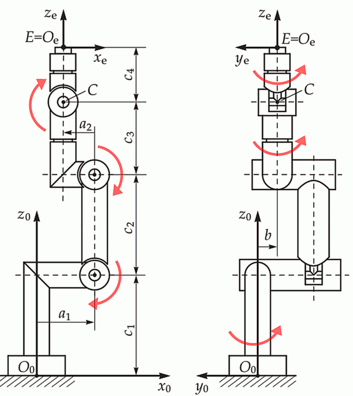

# Getting Started with py-opw-kinematics

**Fast, reliable inverse and forward kinematics for six-axis industrial robots**

This tutorial will walk you through the basics of using py-opw-kinematics for robot kinematics calculations. By the end, you'll be able to:

- Set up robot models with proper kinematic parameters  
- Perform forward and inverse kinematics calculations  
- Handle different Euler angle conventions  
- Configure end-effector offsets for tools  
- Troubleshoot common setup issues  

---

## Installation

```bash
# Install from PyPI (recommended)
pip install py-opw-kinematics

# Or install with development dependencies
pip install py-opw-kinematics[dev,test]
```

**Requirements**: Python 3.11+ • NumPy • Polars

## Basic Concepts

### 1. Understanding the OPW (Ortho-parallel Wrist) Robot Model

The OPW model applies to **six-axis industrial robots** with this specific architecture:

- **Ortho-parallel base** (first 3 axes): Joints 1-3 for major positioning  
- **Spherical wrist** (last 3 axes): Joints 4-6 for orientation control  

**Compatible robots include:**
- Most 6-axis industrial arms
- Comau NJ-60-2.2, NJ-130-2.0, NJ-165-3.0, NJ-290-3.0, N-170-3.0

### 2. Kinematic Parameters

The OPW model uses **7 key parameters** (a1, a2, b, c1, c2, c3, c4) to fully define robot geometry:



| Parameter | Description |
|-----------|-------------|
| `a1` | Base to shoulder distance |
| `a2` | Shoulder horizontal offset |
| `b` | Elbow offset |
| `c1` | Base height |
| `c2` | Upper arm length |
| `c3` | Forearm length |
| `c4` | Wrist length |

> **Where to find these values**: Check your robot's technical documentation, datasheet, or manufacturer specifications.

## Quick Start Example

Let's set up a complete robot and perform basic kinematics calculations:

```python
from py_opw_kinematics import KinematicModel, Robot, EulerConvention
import numpy as np

# Step 1: Define your robot's kinematic parameters, example below is a Comau NJ-165-3.0
kinematic_model = KinematicModel(
    a1=400,      # Distance from base to shoulder
    a2=-250,     # Shoulder offset (negative = Y-direction)
    b=0,         # Elbow offset (zero for most robots)
    c1=830,      # Base height
    c2=1175,     # Upper arm length
    c3=1444,     # Forearm length
    c4=230,      # Wrist length
    offsets=(0, 0, 0, 0, 0, 0),  # Joint angle offsets (usually zero)
    flip_axes=(False, False, True, False, False, False),  # Axis directions
    has_parallelogram=True,  # J2-J3 mechanical coupling
    relative_constraints=[(2, 1, -135, -45), (5, 4, -90, 90)]  # Joint constraints (degrees input)
)

# View the stored constraints (always returned in radians)
print(f"Relative constraints: {kinematic_model.relative_constraints}")
# Output: [(2, 1, -2.356194490192345, -0.7853981633974483), (5, 4, -1.5707963267948966, 1.5707963267948966)]

# Step 2: Define rotation representation
euler_convention = EulerConvention("XYZ", extrinsic=False, degrees=True)

# Step 3: Create the robot instance with tool offset
robot = Robot(
    kinematic_model, 
    euler_convention, 
    ee_rotation=(0, -90, 0)  # Tool pointing down
)

# Step 4: Forward kinematics (joints → position)
joint_angles = [10, 0, -90, 0, 0, 0]  # Joint angles in degrees
position, rotation = robot.forward(joint_angles)

print(f"Position (X,Y,Z): {np.round(position, 2)} mm")
print(f"Rotation (A,B,C): {np.round(rotation, 2)} deg")

# Step 5: Inverse kinematics (position → joints)
target_pose = (position, rotation)
solutions = robot.inverse(target_pose)

print(f"\nFound {len(solutions)} kinematic solutions:")
for i, solution in enumerate(solutions, 1):
    joints_rounded = [round(j, 1) for j in solution]
    print(f"  Solution {i}: {joints_rounded}")
```

**Expected Output:**
```
Position (X,Y,Z): [2042.49 -360.15 2255.  ] mm
Rotation (A,B,C): [  0.   0. -10.] deg

Found 4 kinematic solutions:
  Solution 1: [10.0, 0.0, -90.0, 0.0, 0.0, 0.0]
  Solution 2: [10.0, 90.8, -20.4, 0.0, 69.6, 0.0]
  Solution 3: [10.0, 0.0, -90.0, -180.0, 0.0, 180.0]
  Solution 4: [10.0, 90.8, -20.4, -180.0, -69.6, 180.0]
```

> **Why multiple solutions?** Most robot poses can be achieved in several ways - different "elbow up/down" and "wrist flip" configurations. py-opw-kinematics finds all mathematically valid solutions.

## Understanding the Components

### KinematicModel Parameters

```python
# Example: Setting up a Comau NJ165-3.0 robot
comau_model = KinematicModel(
    a1=400,     # Base to shoulder distance
    a2=-250,    # Shoulder offset (negative means offset in -Y direction)
    b=0,        # No elbow offset for this robot
    c1=830,     # Base height
    c2=1175,    # Upper arm length
    c3=1444,    # Forearm length  
    c4=230,     # Wrist length
    offsets=(0, 0, 0, 0, 0, 0),  # No angular offsets
    flip_axes=(False, False, True, False, False, False),  # J3 and J5 flipped
    has_parallelogram=True,  # J2 and J3 are mechanically coupled
)
```

**Understanding flip_axes:**
- `True` means the joint rotates in the opposite direction
- This accounts for different manufacturer conventions
- Determined by comparing your robot's movements to the standard OPW model

**Understanding has_parallelogram:**
- `True` for robots where J2 and J3 are mechanically linked
- Common in industrial robots for better stiffness
- Affects the kinematic calculations

### Euler Conventions

Different ways to represent the same rotation:

```python
# Intrinsic XYZ (Roll-Pitch-Yaw) - most common
rpy = EulerConvention("XYZ", extrinsic=False, degrees=True)

# Extrinsic ZYX (Yaw-Pitch-Roll) - also common
ypr = EulerConvention("ZYX", extrinsic=True, degrees=True)

# Radians instead of degrees
rpy_rad = EulerConvention("XYZ", extrinsic=False, degrees=False)
```

**Choosing the right convention:**
- Match your robot controller's convention
- XYZ intrinsic is common for tool orientations
- ZYX extrinsic is common for world orientations

### End-Effector Offsets

**Account for tools attached to your robot's flange**

When you attach tools like grippers, welding guns, or 3D printing extruders to your robot, you need to define where the **Tool Center Point (TCP)** is located relative to the robot's flange.

```python
robot = Robot(
    kinematic_model, 
        euler_convention,
        ee_translation=(100, 0, -200),  # TCP offset in mm (X, Y, Z)
        ee_rotation=(0, -90, 0)         # Rotates EE frame so X-axis points outward from the flange.
)
```

> **Transform Order**: The end-effector frame is created by first applying the rotation, then the translation in the rotated coordinate system.

#### End-Effector Rotation (`ee_rotation`)

Defines how the tool frame is oriented relative to the robot flange:
- **Purpose**: Changes the tool's default orientation
- **Impact**: Affects the A/B/C angles for any given pose
- **Units**: Degrees (or radians, depending on your Euler convention)

#### End-Effector Translation (`ee_translation`)

Defines the TCP position relative to the robot flange:
- **Purpose**: Moves the TCP in X, Y, Z coordinates
- **Frame**: Relative to the **rotated** tool frame (after `ee_rotation` is applied)
- **Units**: Millimeters

**Pro Tip**: Measure your tool dimensions carefully! Incorrect TCP definition will cause positioning errors in your robot programs.

## Common Pitfalls and Solutions

### 1. Wrong Kinematic Parameters

**Problem**: Robot doesn't reach expected positions or trajectories are way off

**Solution**: Always verify parameters against manufacturer documentation

```python
# Quick sanity check for robot reach
max_reach = model.c1 + model.c2 + model.c3
print(f"Maximum robot reach: ~{max_reach:.0f} mm")

# Test a known position from manufacturer specs
test_joints = [0, 0, -90, 0, 0, 0]  # Standard test position
position, _ = robot.forward(test_joints)
print(f"Test position: {position}")
# Compare this with your robot's actual position in this pose
```

**Debugging Tips**:
- Compare with manufacturer's DH parameters table
- Check robot datasheet for workspace diagrams
- Measure actual robot dimensions if parameters are unclear

---

### 2. Incorrect flip_axes Configuration

**Problem**: Joint angles have wrong signs or robot moves in unexpected directions

**Solution**: Test with simple, known positions and compare with real robot

```python
# Test each joint individually
def test_joint_directions(robot):
    """Test if joint directions match real robot"""
    base_joints = [0, 0, -90, 0, 0, 0]
    
    for i in range(6):
        # Test positive rotation
        test_joints = base_joints.copy()
        test_joints[i] = 45  # Rotate joint 45°
        
        pos_positive, _ = robot.forward(test_joints)
        
        # Test negative rotation
        test_joints[i] = -45
        pos_negative, _ = robot.forward(test_joints)
        
        print(f"J{i+1} +45°: {pos_positive}")
        print(f"J{i+1} -45°: {pos_negative}")
        print("---")

test_joint_directions(robot)
```

**Debugging Tips**:
- Move your real robot to these positions and compare
- Joint 1 (base): positive should rotate counterclockwise when viewed from above
- Joint 2 (shoulder): positive should lift the arm up
- Joint 3 (elbow): negative usually brings forearm toward upper arm

---

### 3. Wrong Euler Convention

**Problem**: Orientation values don't match your robot controller or expected rotations

**Solution**: Test simple rotations and verify against your robot's coordinate system

```python
# Test coordinate system alignment
def test_euler_convention(robot):
    """Verify Euler convention matches your expectations"""
    
    # Test pure rotations around each axis
    test_orientations = [
        [90, 0, 0],   # 90° around X (roll)
        [0, 90, 0],   # 90° around Y (pitch)  
        [0, 0, 90],   # 90° around Z (yaw)
    ]
    
    base_position = [2000, 0, 1500]  # Point in workspace
    
    for i, orientation in enumerate(test_orientations):
        # Find joint solution for this orientation
        solutions = robot.inverse((base_position, orientation))
        if solutions:
            joints = solutions[0]
            # Verify round-trip
            pos_check, rot_check = robot.forward(joints)
            print(f"Test {['X', 'Y', 'Z'][i]}-axis rotation:")
            print(f"   Input: {orientation}")
            print(f"   Output: {[round(x, 1) for x in rot_check]}")
            print("---")

test_euler_convention(robot)
```

**Debugging Tips**:
- Check if your robot controller uses RPY (Roll-Pitch-Yaw) or Euler angles
- Most industrial robots use extrinsic ZYX (Yaw-Pitch-Roll)
- CAD software often uses intrinsic XYZ (Roll-Pitch-Yaw)
- When in doubt, test with simple 90° rotations around each axis

**Quick Reference**:
- **Intrinsic XYZ**: Rotations applied in moving coordinate frame
- **Extrinsic ZYX**: Rotations applied in fixed world frame
- **Degrees vs Radians**: Match your robot controller's units

## Next Steps


### Additional Resources

- **[Complete API Reference](api.md)**: Detailed documentation for all classes and methods
- **[Developer Guide](developer-guide.md)**: Contributing and extending the library
- **[Example Scripts](../python/examples/)**: Real-world usage examples