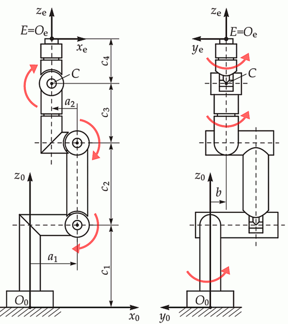

# py-opw-kinematics

**py-opw-kinematics** is a Python wrapper for the [rs-opw-kinematics](https://github.com/bourumir-wyngs/rs-opw-kinematics) library, providing an interface for solving inverse and forward kinematics of six-axis industrial robots with a parallel base and spherical wrist. Designed for convenience and performance, this wrapper is suitable for robotics simulation, control, and trajectory planning directly from Python.

## Key Features

- **Ease of Use**: Fully customizable end-effector rotation using Euler angles. Configurable to use degrees or radians.
- **High Performance**: Capable of batch operations using Polars DataFrames for maximum efficiency. For example, 100,000 inverse kinematic solutions can be computed in just 0.4 seconds.
- **Full Rust Integration**: Uses Rust for the core kinematic calculations, offering speed and robustness while allowing access through Python.
- **Singularity Handling**: Manages kinematic singularities such as J5 = 0° or ±180°.

## Installation

Install using pip:

```sh
pip install py-opw-kinematics
```


Note: Rust is required to compile the underlying Rust library if not using pre-built binaries.

## Usage Example

### Parameters

This library uses seven kinematic parameters (_a1, a2, b, c1, c2, c3_, and _c4_). This solver assumes that the arm is at zero when all joints stick straight up in the air, as seen in the image below. It also assumes that all
rotations are positive about the base axis of the robot. No other setup is required.


<!--  -->

To use the library, create a `KinematicModel` instance with the appropriate values for the 7
kinematic parameters and any joint offsets required to bring the paper's zero position (arm up in Z) to the
manufacturer's position. The direction of each of the axes can be flipped with the `flip_axes` parameter if your robot's axes do not match the convention in the paper.

Additionally, you can specify the Euler convention to use for the end-effector rotation. The `EulerConvention` class allows you to specify the order of the rotations and whether they are extrinsic or intrinsic. The `degrees` parameter can be set to `True` to use degrees instead of radians.

If the robot has a parallellogram between joints 2 and 3, set `has_parallellogram` to `True` to link these axes. 

Below is a basic example demonstrating how to define a robot, configure Euler conventions, and compute forward kinematics.

Single Operation Example
    
```python

from py_opw_kinematics import KinematicModel, Robot, EulerConvention
import numpy as np

kinematic_model = KinematicModel(
    a1=400,
    a2=-250,
    b=0,
    c1=830,
    c2=1175,
    c3=1444,
    c4=230,
    offsets=[0] * 6,
    flip_axes=[True, False, True, True, False, True],
    has_parallellogram=True,
)
euler_convention = EulerConvention("XYZ", extrinsic=False, degrees=True)
robot = Robot(kinematic_model, euler_convention, ee_rotation=[0, -90, 0])

# Compute forward kinematics for a given set of joint angles
angles = [10, 0, -90, 0, 0, 0]
position, rotation = robot.forward(angles)
print(f"Position: {np.round(position,2)}, Rotation: {np.round(rotation,2)}")

# Compute inverse kinematics for a given position and rotation
for solution in robot.inverse((position, rotation)):
    print(f"Solution: {np.round(solution, 2)}")

```
This example prints:
    
```
Position: [2042.49 -360.15 2255.  ], Rotation: [  0.   0. -10.]
Solution: [ 10.   0. -90.  -0.   0.   0.]
Solution: [ 10.    90.76 -20.4   -0.    69.6    0.  ]
Solution: [  10.    0.  -90. -180.    0.  180.]
Solution: [  10.     90.76  -20.4  -180.    -69.6   180.  ]
```

## Acknowledgements

This project builds on the Rust library rs-opw-kinematics by Bourumir Wyngs, which itself draws inspiration from:

- The 2014 research paper: An Analytical Solution of the Inverse Kinematics Problem of Industrial Serial Manipulators with an Ortho-parallel Basis and a Spherical Wrist, authored by Mathias Brandstötter, Arthur Angerer, and Michael Hofbaur (ResearchGate link).
- The C++ project opw_kinematics, which provided valuable insights for validation and testing.


## Licensing

The `py-opw-kinematics` library itself is licensed under MIT.

The image `opw.png`, used for documentation purposes, is sourced from [opw_kinematics](https://github.com/Jmeyer1292/opw_kinematics) and is licensed under the Apache License 2.0. 